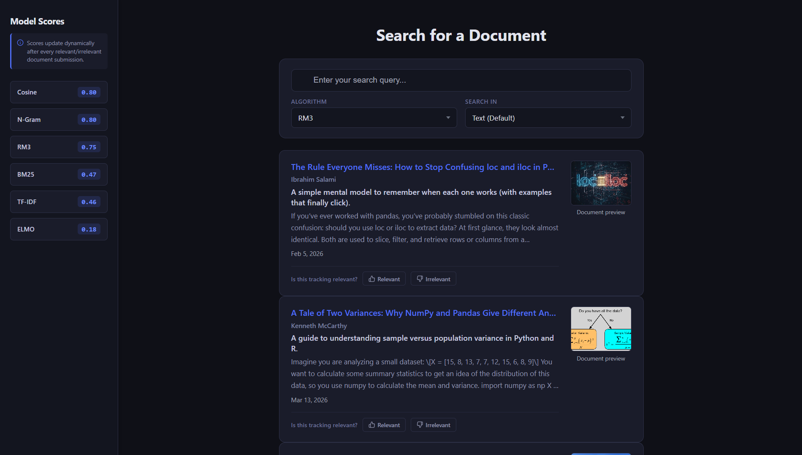
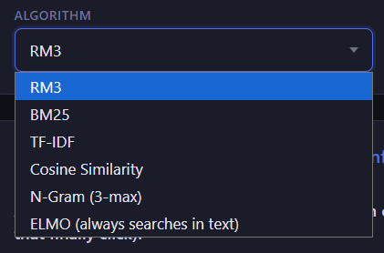
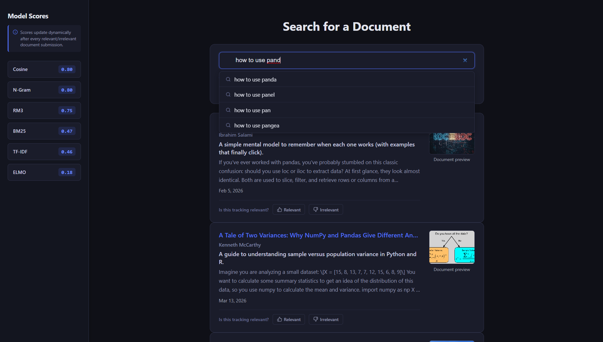
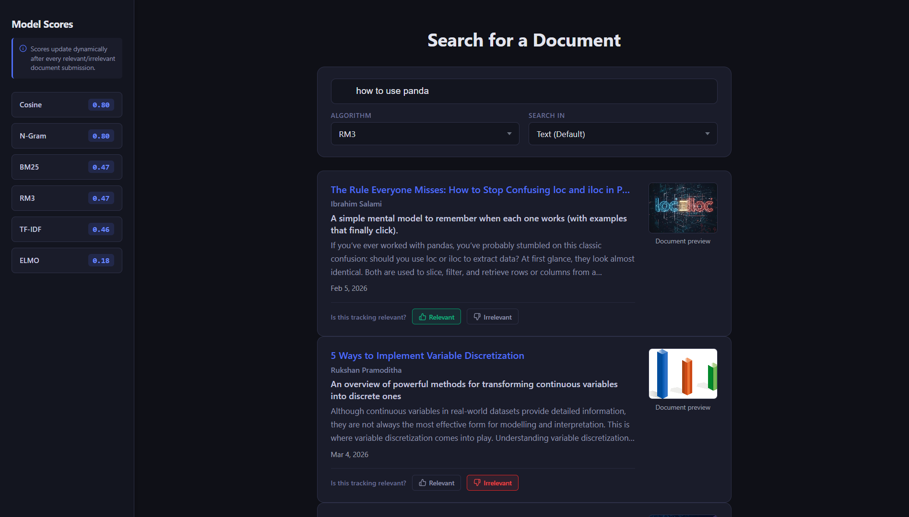

# Search Engine using Multiple Information Retrieval Models

<p align="center">
  
  
  
  
</p>

<p align="center">
  A full-stack document search engine for data science articles, powered by multiple Information Retrieval models, query suggestions, user feedback, and model evaluation.
</p>

<p align="center">
  <b>Angular</b> | <b>Flask</b> | <b>PyTerrier</b> | <b>NLTK</b> | <b>scikit-learn</b> | <b>TensorFlow Hub</b> | <b>Pandas</b>
</p>

---

## Project Overview

This project is a search engine that compares several Information Retrieval models on a custom data science document collection.

The pipeline starts with `notebooks/webScraping.ipynb`, which scrapes a configurable number of data science articles from Towards Data Science and saves the collected documents into `data/Articles.csv`. Then `notebooks/Main_File.ipynb` handles the cleaning, preprocessing, and indexing work needed for search.

The final application is split into an Angular frontend and a Python Flask backend. The user can choose a search model, choose whether to search in the document title, subtitle, or text, then receive ranked results with document metadata and links to the original articles.

The system also includes query suggestions, next-word suggestions, recommended documents, and a user feedback flow where users mark results as relevant or irrelevant. That feedback is saved in JSON and used to calculate model scores with precision, recall, and F1 score.

---

## Features

| Feature | Description |
| --- | --- |
| Multi-model search | Search with BM25, TF-IDF, RM3, Cosine Similarity, N-Gram models, or ELMo. |
| Search field selection | Search over `Text`, `Title`, or `SubTitle`. ELMo searches over text embeddings. |
| Query suggestions | Suggests word completions and likely next words using terms from the indexed collection. |
| Result cards | Shows title, author, subtitle, date, image preview, text snippet, score, and source link. |
| Feedback evaluation | Users vote documents as relevant or irrelevant. |
| Model ranking | Models are ranked dynamically using average F1 score from feedback history. |
| Recommendation feed | Initial results include random documents plus documents related to previous search queries. |
| Cached ELMo embeddings | ELMo document embeddings are cached in `data/cache/elmo_cache.npy` after first generation. |

---

## Search Models Used

The project uses a mix of lexical, statistical, language-model, and embedding-based retrieval approaches.

| Model | Implementation | Notes |
| --- | --- | --- |
| BM25 | PyTerrier | Strong lexical retrieval baseline using term frequency, inverse document frequency, and document length normalization. |
| TF-IDF | PyTerrier | Classic vector-space weighting model for matching important query terms against documents. |
| RM3 | PyTerrier | Pseudo-relevance feedback model that expands the original query before retrieving results again. |
| Cosine Similarity | scikit-learn | Builds TF-IDF vectors and ranks documents by cosine similarity to the query. |
| N-Gram | Custom Python logic | Uses unigram, bigram, and trigram probabilities with smoothing for queries up to three words. |
| ELMo | TensorFlow Hub | Uses contextual word embeddings and cosine similarity for semantic document matching. |

I can implement the retrieval math from scratch, including TF-IDF weighting, BM25 scoring, cosine similarity, query likelihood, and n-gram probabilities. In this project, libraries such as PyTerrier, scikit-learn, and TensorFlow Hub were used for better optimization, faster development, and more reliable model execution within the project timeline.

---

## Architecture

```text
notebooks/webScraping.ipynb
        |
        v
data/Articles.csv
        |
        v
notebooks/Main_File.ipynb
        |
        +--> data/Preprocessed_Articles.csv
        +--> backend/indexing/index
        +--> backend/indexing/indexTitle
        +--> backend/indexing/indexSubTitle
        |
        v
backend/main.py  <-------------------->  Frontend/src/app
Flask API                              Angular UI
        |
        +--> /result       search endpoint
        +--> /suggest      autocomplete and next-word suggestions
        +--> /Feedback     relevance feedback and model scoring
        +--> /updatescore  current model scores
        +--> /recommend    recommended starting documents
```

### Main Files

| Path | Purpose |
| --- | --- |
| `backend/main.py` | Main Flask API, search model routing, suggestions, recommendations, and feedback scoring. |
| `backend/elmo_model.py` | Loads ELMo from TensorFlow Hub, builds/caches embeddings, and performs semantic search. |
| `backend/preprocessing.py` | Shared text preprocessing helpers for stemming and ELMo-safe cleaning. |
| `notebooks/webScraping.ipynb` | Scrapes article links and article fields into `data/Articles.csv`. |
| `notebooks/Main_File.ipynb` | Cleans data, tokenizes, removes stopwords, lemmatizes, prepares indexes, and experiments with models. |
| `Frontend/src/app/app.ts` | Angular component logic, API calls, model selection, search state, suggestions, and feedback. |
| `Frontend/src/app/app.html` | Main UI structure for sidebar scores, search controls, suggestions, and result cards. |
| `scripts/start_project.bat` | Windows launcher for starting backend and frontend together. |

---

## Technologies Used

### Backend and IR

- Python
- Flask
- Flask-CORS
- PyTerrier
- NLTK
- Pandas
- NumPy
- scikit-learn
- TensorFlow
- TensorFlow Hub
- Java/JDK for PyTerrier

### Frontend

- Angular
- TypeScript
- Angular Forms
- CSS
- RxJS

### Data and Storage

- CSV files for raw and preprocessed article data
- PyTerrier index files for searchable fields
- JSON files for feedback and recommendation tracking
- NumPy cache file for ELMo embeddings

---

## Dataset

The dataset is built from scraped Towards Data Science articles. The current `data/Articles.csv` contains article metadata and full text fields:

| Column | Description |
| --- | --- |
| `index` | Article index from scraping. |
| `Title` | Article title. |
| `SubTitle` | Article subtitle or summary. |
| `Author` | Author name. |
| `Text` | Full article text. |
| `date` | Publication date. |
| `image` | Article thumbnail image URL. |
| `Link` | Original article URL. |

Generated data files:

- `data/Articles.csv`: raw scraped article collection.
- `data/Preprocessed_Articles.csv`: cleaned and normalized text used for search.
- `data/Feedback.json`: relevance votes and model evaluation scores.
- `data/recommend.json`: search frequency memory used by the recommendation endpoint.
- `data/cache/elmo_cache.npy`: cached ELMo document embeddings.

---

## Screenshots

### First Look



### Model Scores



### Search Suggestions



### Search Results



---

## Installation

### Requirements

Make sure these are installed:

- Python
- Node.js and npm
- Angular CLI
- Java/JDK, required by PyTerrier
- Python packages from `requirements.txt`

### 1. Clone or Open the Project

```bash
cd "DM Project"
```

### 2. Install Python Requirements

```bash
pip install -r requirements.txt
```

### 3. Install Frontend Dependencies

```bash
cd Frontend
npm install
cd ..
```

### 4. Run the Project

The intended quick start is the Windows launcher:

```bat
scripts\start_project.bat
```

It starts:

- Flask backend at `http://localhost:5000`
- Angular frontend at `http://localhost:4200`

Then open:

```text
http://localhost:4200
```

### Manual Run

Backend:

```bash
python backend/main.py
```

Frontend:

```bash
cd Frontend
npm start
```

Note: the first ELMo run may take longer because TensorFlow Hub loads the model and creates the embedding cache.

---

## API Endpoints

| Endpoint | Method | Purpose |
| --- | --- | --- |
| `/result` | POST | Runs the selected model against the selected field and returns ranked documents. |
| `/suggest` | POST | Returns autocomplete and next-word suggestions. |
| `/Feedback` | POST | Saves user relevance feedback and updates model scores. |
| `/updatescore` | POST | Returns the current average score for each model. |
| `/recommend` | POST | Returns starting documents based on search history and random sampling. |

---

## Evaluation

The feedback system stores user votes in `data/Feedback.json`. A document is treated as relevant for a query when its relevant votes are greater than or equal to its non-relevant votes.

For each model and query, the backend calculates:

- Precision
- Recall
- F1 score
- Average model score across evaluated queries

The Angular sidebar displays these average scores and sorts the models from highest to lowest.

---

## Future Improvement

- Re-rank search results using user relevance feedback instead of only using feedback for evaluation.
- Add author search as a supported search field.
- Support more languages beyond English.
- Improve the recommendation system with personalization and stronger ranking logic.
- Add pagination and filters for larger document collections.
- Add automated tests for backend endpoints and frontend search behavior.
- Move configurable paths, ports, and model settings into environment variables.

---

## Authors and Contributions

This project was built as a collaborative Information Retrieval project by Omar Ashraf Mahmoud and Ahmad Magdy.

| Contributor | Details | Main Work |
| --- | --- | --- |
| Omar Ashraf Mahmoud | Computer Science Major - Data Science & Artificial Intelligence (DSAI)<br>Zewail City of Science and Technology<br>Student ID: `202400725`<br>College Email: `s-omar.amahmoud@zewailcity.edu.eg`<br>Personal Email: `omar.ashraf.hamed2017@gmail.com` | Frontend, backend, data scraping, and part of the data cleaning pipeline. |
| Ahmad Magdy | Computer Science Major - Data Science & Artificial Intelligence (DSAI)<br>Zewail City of Science and Technology<br>Student ID: `202400517`<br>College Email: `TBA`<br>Personal Email: `TBA` | Search models implementation and part of the data cleaning pipeline. |

---

## License

This project is licensed under the [MIT License](https://github.com/Omar-astro/ebay-web-scraper/blob/main/LICENSE).

Feel free to use, modify, and build upon this work. Please give proper credit to the original authors when using or extending the project.

---

## Project Tags

`information-retrieval` `search-engine` `bm25` `tf-idf` `rm3` `cosine-similarity` `n-gram` `elmo` `flask` `angular` `pyterrier` `nltk` `tensorflow` `data-science`

